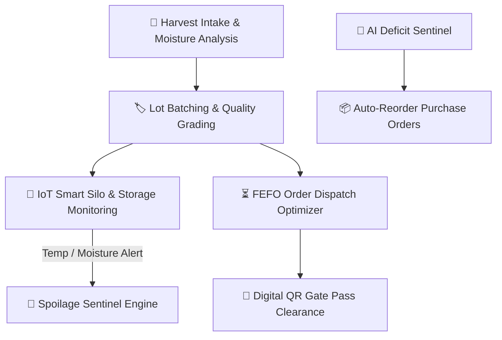

# 🌾 AgriSync-WMS Pro — Smart Agricultural Warehouse Management System

[](https://spring.io/projects/spring-boot)
[](https://react.dev)
[](https://www.mongodb.com/atlas)
[](https://github.com/apugazh61-debug/AgriSync-WMS-)
[](https://github.com/apugazh61-debug/AgriSync-WMS-)
[](https://docs.docker.com/compose)
[](https://jwt.io)

An **Enterprise-Grade, AI-Powered Agricultural Warehouse & Cold-Chain Management Platform** designed for smart grain silos, cold storage facilities, seed certification centers, and multi-depot agro-logistics.

---

## 🌟 Enterprise Agricultural Capabilities



### 1. 📡 Smart Silo & Cold Storage IoT Telemetry Grid (`/iot-telemetry`)
* **Real-time Ambient Temperature & Relative Humidity** telemetry.
* **Grain Moisture % Sentinel** (Paddy & Wheat optimum threshold: 12.0% - 14.0%).
* **Autonomous Spoilage & Fungal Mold Threat Prevention** with live alerts.
* Interactive sensor pinging & WebSocket real-time broadcast.

### 2. ⏳ FEFO (First-Expired, First-Out) Multi-Lot Dispatch Optimizer (`/batch-lots`)
* Multi-lot traceability per agricultural commodity with harvest & expiration dates.
* Automated **FEFO Picking Route Generator** prioritizing earliest expiring lots.
* **1-Click "Confirm & Execute FEFO Dispatch"** with real-time stock deduction.
* Interactive **Register Harvest Lot Modal** with intake moisture and certified quality grades.

### 3. 🤖 Autonomous Supplier Reordering (PO Hub) (`/purchase-orders`)
* Continuous safety-stock threshold scanner detecting crop deficits across depots.
* Automatic electronic **Purchase Order (PO)** generation with optimal supplier matchmaking.
* 1-Click **"Approve & Dispatch PO"** workflow.

### 4. 🏷️ Encrypted Digital QR Gate Pass & Stock Audit (`/gate-passes`)
* Base64-encrypted **ZXing QR Code Gate Passes** with driver, vehicle, and cargo checksums.
* Fast security checkpoint exit clearance & printable gate pass slips.
* 1-Click **Stock Audit CSV Export** for certified regulatory compliance.

### 5. 🗺️ Multi-Zone Storage & Silo Capacity Map (`/zones`)
* Visual capacity tracking for Grain Silos, Cold Storage Chambers, and Dry Bunkers.
* Bin-level occupancy tracking and target environmental control monitoring.

### 6. 📊 Real-Time Agricultural Intelligence Dashboard (`/dashboard`)
* Live inventory valuation in **INR (₹ Cr)** and total stored tonnage.
* 6-Month historical harvest outbound freight trend.
* Depot stock comparison bar charts and live dispatch activity feed.

---

## 🛠️ Architecture & Tech Stack

### Backend
* **Java 17** + **Spring Boot 3.2**
* **Spring Data MongoDB** — document repository with embedded multi-lot relational models
* **Spring Security 6** + **Stateless JWT** (Role-Based: ADMIN / STAFF)
* **Spring WebSocket (STOMP + SockJS)** — live IoT sensor stream
* **ZXing Core 3.5.2** — 2D QR Code & Barcode synthesis
* **Lombok** & **ModelMapper**

### Frontend
* **React 18** + **Vite 8**
* **Vanilla CSS Glassmorphism + Tailwind CSS**
* **Lucide React** — ultra-modern iconography
* **Recharts** — dynamic telemetry gauges, area curves & vertical bar charts
* **React Router v6** + **React Hot Toast**

---

## 🚀 Quick Start

### 1. Backend Setup
```bash
cd backend
mvn clean install
mvn spring-boot:run
```
*Backend runs on `http://localhost:8080` (Embedded MongoDB active on port 27777).*

### 2. Frontend Setup
```bash
cd frontend
npm install
npm run dev
```
*Frontend runs on `http://localhost:3000`.*

### 🔐 Default Credentials
* **User ID**: `1`
* **Password**: `123`
* **Role**: `ADMIN`

---

## 📄 License
Designed & Engineered by **Team RED-ANT** — Built for Next-Gen Agri-Logistics.
